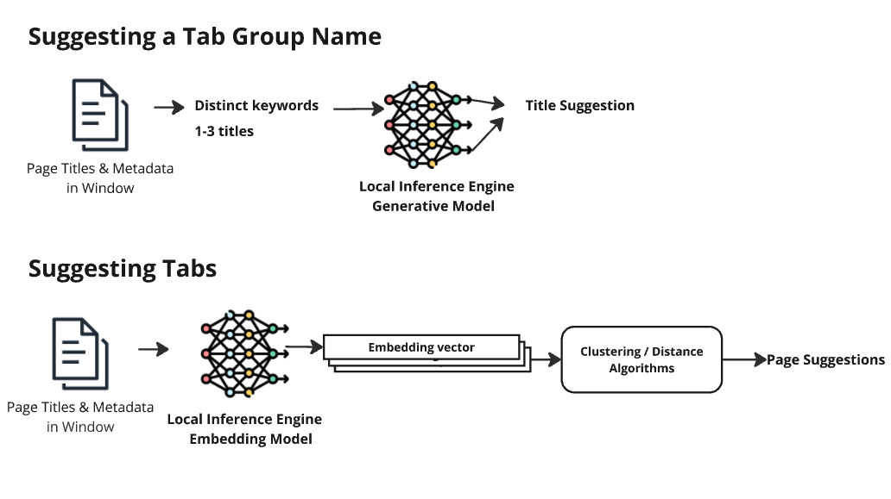
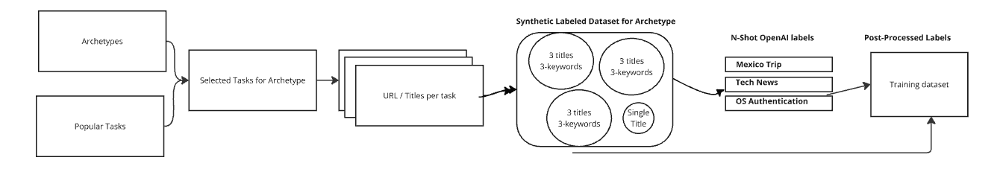

## Smart Tab Grouping

Smart Tab grouping encompasses:

    Suggesting a title for user created group of tabs

    Suggesting tabs from current window to be added to the current group

    Suggesting groups from current window [Currently out of Scope]

### Basic Architecture

Smart Tab grouping uses standard embedding models for grouping, and a fine tuned model for text generation.


Notes on Diagram: All inference is in browser using the Firefox AI runtime and other local algorithms.

 ‘Distinct keywords’ are picked for inference using c-tf-idf algorithm, which finds relatively unique keywords in the title and description of the document with respect to the rest of the document.This helps distinguish what is unique about a group.
 
### Topic Name Data Generation Pipeline



• Generate Archetypes and Synthetic Browsing History
``
   gen_annotation_data.py
``

• Preprocess Clusters as Client does
``
   tab_title_tuning_data.py
``

• Generate Labels
```
   tab_title_tuning_data.py
```

• Simplify Labels
```
   SimplifyMLTopics.ipynb
```

• Cluster Labels
```
   /analysis/Directed Training Clusters.ipynb
```

•Fine tune and export ML model
see [src/jobs/Readme.md](See Read Me for Tuning model)

• Analyze Results
   /analysis/Rouge Scores.ipynb

